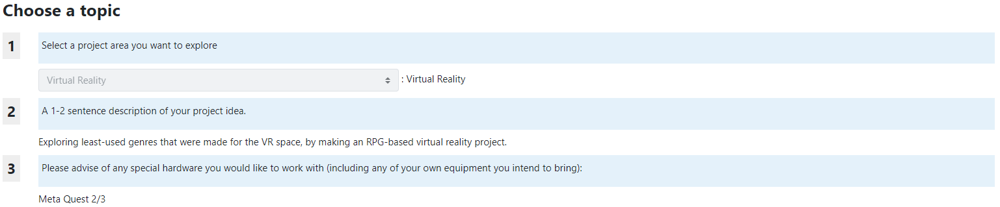
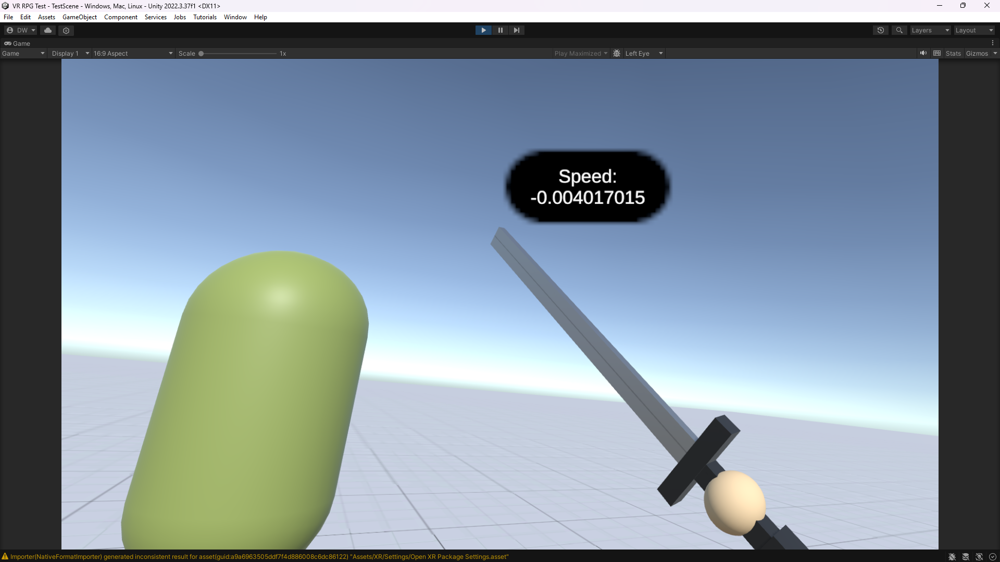
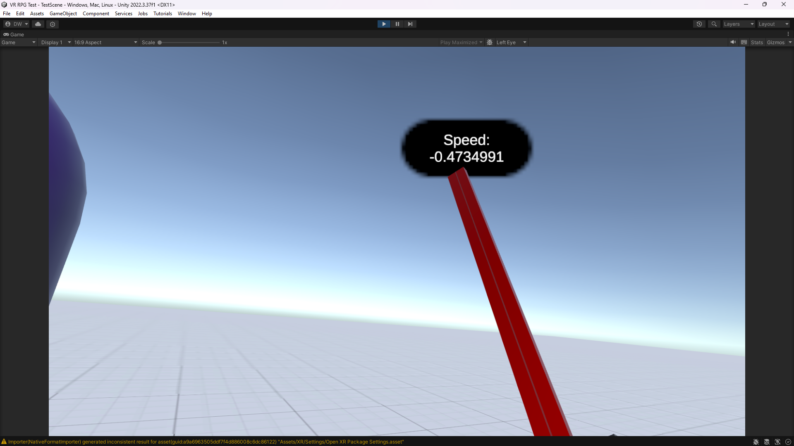
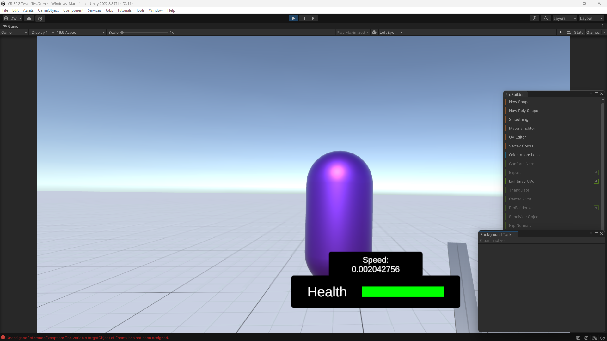
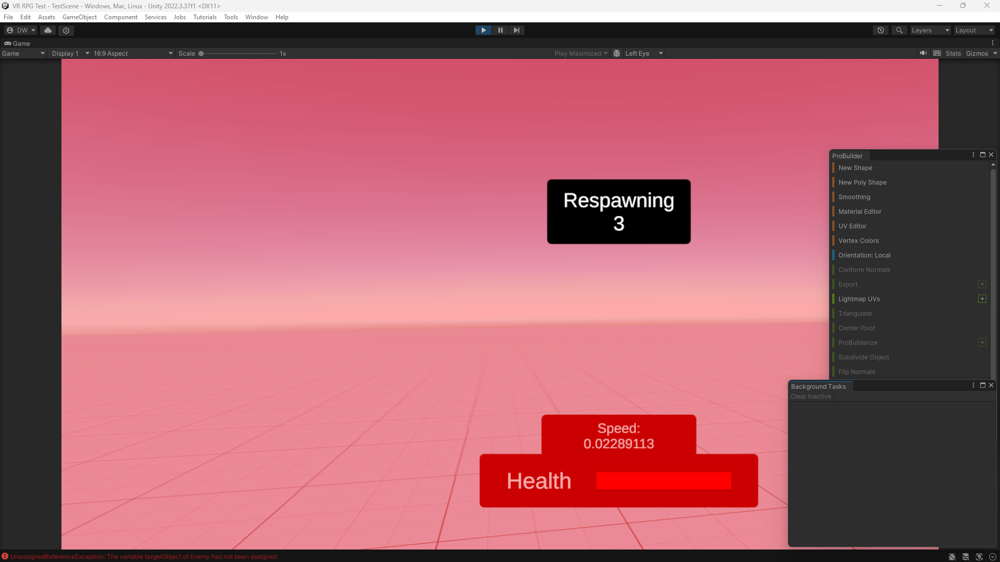
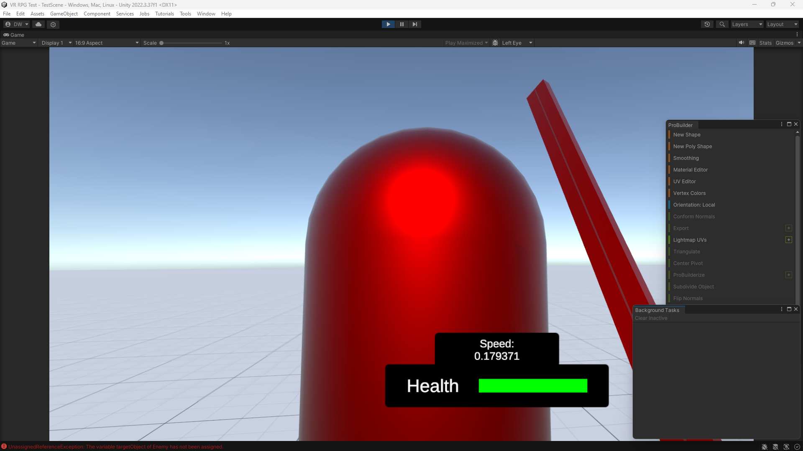
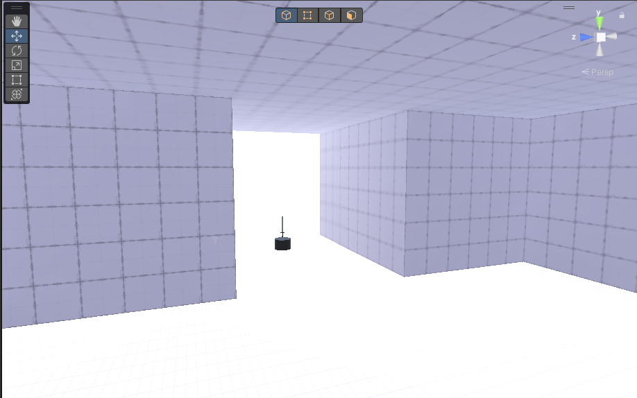
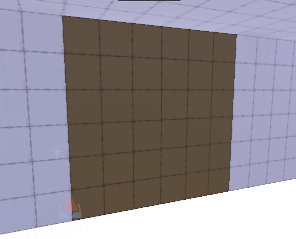
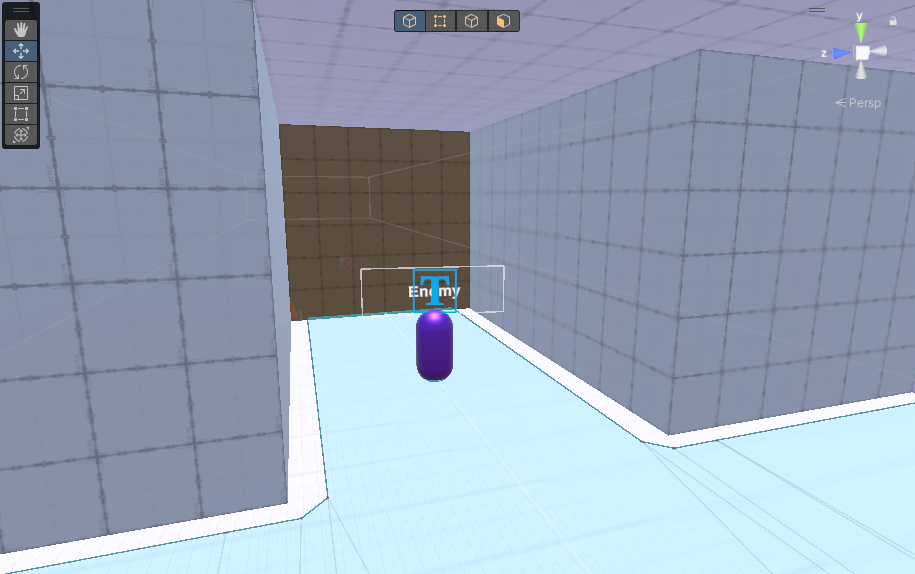
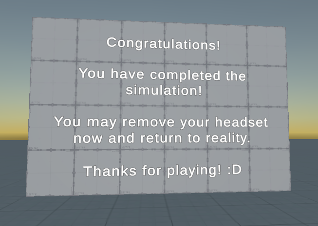

# COMP3180 Final Project

## Week 1 - Selecting a Project

Complete the "Choose a Topic" survey in iLearn and paste the details here.

## Week 2 - Narrowing Focus & Tool Familiarisation

You need to have accepted this assignment repo and made a post here identifying a resource relevant to your topic.

It is not common to find many tutorials that aim to help developers on making genres that are not popular in the VR space. However, looking into RPG games, there are distinct differences that should be noted between VR and non-VR spaces. Not only it provides immersion to gameplay, there are also some other differences:
- Character creation is not necessary if the RPG game is single-player. There are highly less circumstances of seeing your own character if you are the character in immersion. Otherwise, the game can stick to one generic avatar for every player in the field.
- Handling melee weapons are more proficient in performance than ranged weapons. Ranged weapons such as bow and arrow, or a gun, must be programmed to maintain the immersion of using them, such as the consequence of using a rifle with one hand.

Matteo311, a YouTuber with over 30 years of gaming experience across many platforms, emphasises on how an RPG game can be made in a VR space.
 
https://www.youtube.com/watch?v=AsifJMQRIM8

The Broken Seal is also an RPG VR game inspired by World of Warcraft which takes in the aspect of character immersion using weapons to take down enemies and dodge attacks.
 
https://www.youtube.com/watch?v=tVB_n-18Ok0
 
https://store.steampowered.com/app/710170/The_Broken_Seal/

Alternatively, there is another genre which is not popular compared with other genres: an endless runner. This will be arcade inspired and tests the player further through immersion. For example, the player would have to not only use their hands, but also perspective (how the player looks around to cause inputs). A few projects were created that revolves around the runner-aspect:

VR runner game Unity3D asset store tutorial:
 
https://www.youtube.com/watch?v=WwDOwH_mLLc

A Great Endless Runner in VR - Volkan for Daydream VR Hands-On Review:
 
https://www.youtube.com/watch?v=dDv-PvA_tAw

## Week 3 - Research (Reading & Prototyping)

3 mechanics to think about for the RPG VR game, and explain them in the presentation.
- <b>Battle System</b>
	 
  https://www.youtube.com/watch?v=AsifJMQRIM8
	 
  https://www.youtube.com/watch?v=0G1_0k1uWcA
  - Given the RPG games now,  many follow a similar battle style which involves the use of enemies, combat, and more. However, due to the RPG games nowadays that are in-depth and detailed like Skyrim, many RPG games struggle to keep up with the VR market.
  - Also, VR development is a lot complex that making games on desktop, and the fundings for VR are comparatively less.
  > You have to face the fact that VR Gaming is still niche, and not everyone enjoys RPGs.
- <b>Weapons</b>
	 
  https://www.youtube.com/watch?v=ByRWGzxk5kA
  - Looking at Super Hot, asides from using melee weapons like swords, handguns are also possible to implement, while retaining immersion. In simple terms, it would be easy to make a ranged weapon that a person can handle with one hand instead of two.
  - Aditionally, it is also possible to have your own hands as weapons in this case. Obviously this would deal much less damage than a weapon, unless you're wearing boxing gloves.
- <b>UI</b>
	 
  https://www.youtube.com/watch?v=yhB921bDLYA
  - This is one out of many videos that could help me in making a simple UI for VR. More research would still need to be taken to make it sophisticated in terms of RPG.

There are also some academic sources that I have found that will teach further about the emerging VR and the use of RPGs.
- Virtual Reality and Games [Carolina Cruz-Neira, Marcos Fernández, and Cristina Portalés]
  - This is one of the main academic sources explaining the concept, importance and complexity of VR throughout technology and experience.
  > VR is a multimodal, interactive technology, since users need to interact with the simulated world as naturally as possible, and do it in a similar way as they would do it the real world.
- Role-play in Virtual Reality Game for the Senior [Yu-Chen Yang]
  - This explains the correlation between VR and RPG, and how it may appeal to the VR audience who have not played RPGs.
  > In Aaron Dignan's book, the game is fascinating for 12 reasons:
  > 1. The game can be omnipresent
  > 2. The game has a clear goal
  > 3. The game asks us to solve the problem
  > 4. The game gives us a sense of control
  > 5. The game lets us see progress
  > 6. The game gives us the opportunity to take risks
  > 7. The game lets us experience fear
  > 8. The game brings us glory
  > 9. The game changes the sense of time
  > 10. The game brings people closer to each other
  > 11. The game affects the real world
  > 12. The game allows us to show our ability
- Game-based Storytelling Using Role Playing Game and Expansion to Virtual Reality [Nusrat Xahan Chamok, Md. Ikbal Hossain, Pranto Paul, Israt Jahan Labonno and Md. Atiqur Rahman Shujon]
  - This source mainly explains the use of RPGs and storytelling, but also emphasises on its future when VR takes place.
  > But among all the VR gaming options available, RPG (Role-Playing Game) is the best of all. VR headsets and controllers allow a user to experience a game like the user has been transported to that world... Virtual Reality technology is massively improving in our current time, in about a few years, heavy gadget VR consoles would be available for very cheap much like the evolution of the computer itself.

### Learning Outcomes
- Understand the use of VR headsets to accomplish and accompany game development tasks for VR games, such as connecting Unity to Meta Quest.
- Evaluate the importance and use of RPGs in VR and identify its main mechanics (Battle system, weapons, and UI).
- Create a VR project prototype that uses the main mechanics of the RPG game to explain the practical use of them in a VR world.

## Week 4 - Research (Reading & Prototyping)

Switching to Action RPG to focus more on gameplay rather than character and story. Main mechanics like Battle System, Weapons, and Inventory.

### Game Examples
- Asgard's Wrath 2
- Skyrim VR
- Fallout 4 VR

### Matteo311
- YouTuber with over 30 years of gaming and reviewing experience across platforms, including VR. 
- Benefits of VR
  - Character creation and presence
  - Visual appealing weapons
  - Level design with potential for multiplayer
  - Impactful environments
  - Player-generated content (finding different ways and feelings in completing the game)
    - Characters having unique stats; pros and cons
- Downsides of VR
  - VR lacks storytelling and struggles to keep up its gameplay length.
  - VR games have less funding compared to desktop games.
  - VR development is complex.
  > “A VR RPG would be a niche within a niche. You have to face the fact that VR Gaming is still niche, and not everyone enjoys RPGs.”
    
  – Matteo311 (2019) in ‘The BEST VR RPG - We need Baldur's Gate 3 VR’

### Learning Outcomes
Changed the Learning Outcomes to fit the purpose of my project better.
- Understand the use of VR headsets to accomplish and accompany game development tasks for VR games, such as connecting and testing Unity games in Meta Quest.
- Evaluate the importance and use of Action RPGs in VR, utilising its main mechanics (Combat system, weapons, and inventory) to create a successful concept.
- Create a VR project prototype that uses the main mechanics of an Action RPG to explain the practical use of them in a VR world.

## Week 5 - Presentations (& research/rescoping)

I have been looking at some sources to seek on minimizing motion-sickness in VR, which I came across this source:

### Getting Rid of Cybersickness: In Virtual Reality, Augmented Reality, and Simulators
Authors: Andras Kemeny, Jean-Rémy Chardonnet, Florent Colombet
> Getting Rid of Cybersickness will help readers to understand the underlying technics and social stakes involved, from engineering design to autonomous vehicle motion sickness to video games, with the hope of providing an insight of VR sickness induced by the emerging immersive technologies.

- Vection mainly caused for movement-based systems referring to self-motion by visual stimulation. This is achieved in VR as well as driving simulations.
  - A perceptive illusion by causing clean movement while the subject is objectively motionless.
  - Makes us believe that they are moving in the virtual world while being stationary in the real world (differences in movement between virtual and real).
  > The sensation of self-motion movement is thus the result of the interaction between visual and inertial stimulus. In addition, it has optimal characteristics when these two stimuli are coherent. Conflict results in either degradation of the vection or a choice of a dominant modality. Furthermore, conflicts between visual and vestibular information can also cause the occurrence of motion sickness (Hettinger et al. 1990).

### Project Deliverables
- Final Project Report – Evaluation of deliverables and portfolio
- Prototype Build in Unity – Main prototype to describe the practical use
- Portfolio Piece Demonstration Video – Video describing the use of the prototype (how it works)
- Game Design Document – Building concepts and recommendations for Action RPGs and its main mechanics
- Surveys with Data Trends using Graphs and Charts – Providing evidence to support and discover ways in improving the experience in VR and Action RPGs

## Week 6 - Presentations (& research/rescoping)
Research Report has started, but not much progress was made other than the very first sentence written for the report.

> In this COMP3180 unit, this study will experiment with the virtual reality experience of an Action RPG genre using VR headsets (such as Meta Quest 2).

### Learning Outcomes
Learning Goals have been reshaped to not sound like deliverables, but much rather sound like I'm gaining skills out of the experience.
- Understand the use of VR headsets to accomplish and accompany game development tasks for VR games, such as connecting and testing Unity games in Meta Quest.
- Analyse the user experience of virtual reality to understand what the user feels throughout the experience and aim to improve over future VR projects.
- Evaluate the importance and use of Action RPGs in VR, utilising/explaining the practical use of three main mechanics: Combat, weapons, and movement.
- (Stretch) Analyse and mitigate known risks of virtual reality, such as motion sickness.

Commonly for an Action RPG genre, it obviously involves more action-based styles of gameplay, and they may ideally rely on character stats and systems for variety. Weapons can act as their own attack systems which operate on functionality and result.

> Some require a careful memorization of attack patterns and learning through your consecutive failures. Each can offer different challenges to tackle and ultimately comes down to personal choice. - Dreams Quest

Usually it takes time for a user to get used to the system before they can truly master the mechanics of combat. Even then, it becomes a gameplay loop for an Action RPG with repetitive combat, which is why weapons can have their own progression systems.

> There are new abilities to gain, which scale with the gear you find, that drops from more and more challenging enemies. And to test your new skill, a boss fight can occur to humble you for your hubris. - Dreams Quest

Giving weapon their own abilities with a given level progression can give even more variety on each weapon. However for now in this scope, the weapon level can be manually adjusted.

As for movement, it will have two ways: free-form movement, or teleportation. Free-form movement is the usual default in moving around, but as explained in Week 5:

> Conflicts between visual and vestibular information can also cause the occurrence of motion sickness (Hettinger et al. 1990).

In this case, free-form movement can give differences on how we move and how we think that we are moving (between virtual and real world), which can become troublesome. Teleportation is one of the ways of mitigating motion sickness, however, the two forms of movement will have their pros and cons and will be analysed in the project.

## Week 7 - Research Report Finalisation

The notes about Action RPG have been taken as inspiration from a review of Dark Souls.

### Dark Souls RPG Through the Lens of Challenge
Authors: Seth Gaither, Newton Lee 
- 2011 Action RPG built for high difficulty.
- Story isn't revealed much from the start but rather included in NPC interactions and item descriptions, leaving players to find the plot themselves. It is optional as the game can still be beaten without understanding the plot.
- > Patience, timing, and careful stamina usage are important in order to succeed in Dark Souls.
- Souls are experience points and currency to Dark Souls. They can all be dropped when the player dies, and lost forever if the player dies again before reaching them.
- Exploration is necessary for the player, even if it's not clear to them. Important items are kept in places that players won't commonly see, leaving them clueless.
- Dark Souls has a blacksmith that upgrades weapons and armour to fight stronger bosses.
- This game inspires Action RPG with lack of direct storytelling and allows to focus on a gameplay system: movement, weapons, and combat.

### Deliverables
- Final Project Report with Evaluation (7 hours)
  - Weekly Milestones: A (~350 word) summary of key achievements for weeks 8 to 13 (1 hour).
  - Deliverables: A (~250 word) description of all project deliverables linked to GitHub and portfolio (2 hours).
  - UX/Usability Evaluation: An (~800 word) evaluation of the project’s effectiveness and user experience based on the feedback from gamers and developers (non-VR and VR alike) via surveys, interviews, and questionnaires (2 hours).
  - Learning Reflection: A (~400 word) section reflecting on the skills learnt in advanced game development regarding the learning goals in the report (1 hour).
  - Industry Relevance: A (~200 word) section outlining how the skills learnt in the project development apply to the game industry (1 hour).
- Unity Prototype Build (18 hours)
  - Movement (3 hours)
    - Implementing Free-form Movement and Interaction with hand controllers (3 hours)
    - Add an alternate method of movement: Teleporting Movement (Stretch: If there is extra time left)
  - Weapons (7 hours)
    - Make a functional damage system and hitbox for Melee Punching (2 hours)
    - Make a functional damage system and hitbox for Sword (2 hours)
    - Make a functional damage system and projectile hitbox for Handgun (3 hours)
  - Combat (8 hours)
    - Create two types of Enemies with hitbox and behaviour (4 hours)
      - Melee Enemy (1.5 hours)
      - Ranged Enemy (2.5 hours)
    - Implement a Health System for player and enemy (2 hours)
    - Add Level Progression for how many enemies are destroyed and reward with higher levels of weapon strength (2 hours)
- Four-minute Video Portfolio (5 hours)
  - Demonstration of the Unity Prototype Build including main mechanics: Movement, Weapons, and Combat (2 hours)
  - Highlighting the GUR approach on prototype build and key study achievements/findings (3 hours)
- Game Design Document (6 hours)
  - Documentation of the game’s purpose/aim (~100 word) (1 hour)
  - Documentation of assets (~300 word) (2 hours)
  - Documentation of mechanics: Movement, Weapons, and Combat (~600 word) (3 hours)
- Games User Research Report (~1000 word) (14 hours)
  - Study methodology selection/design, including PENS (3 hours)
  - Study execution with at least 10 participants (4 hours)
  - Observation, analytics and survey data collation (3 hours)
  - Analysis of collected data (4 hours)
- Evaluation Artefacts (7 hours)
  - Questionnaire: Weighed-Score Results from the Player Experience of Needs Satisfaction (PENS) based on Immersion, Intuitive Controls, and Competence. (2 hours)
  - Survey: Comparing the project with existing VR RPGs. (2 hours)
  - Interview: Feedback from players/developers about the RPG project and virtual reality. (3 hours)

I admittedly made a mistake in the Research Report about the count and never removed the instructions in the Deliverables. I hope to change them now but it's too late regardless.

## Week 8 - Project Development

Planning was only done in this case.

Referring to this quote according to Role-play in Virtual Reality Game for the Senior [Yu-Chen Yang]:
> In Aaron Dignan's book, the game is fascinating for 12 reasons:
  > 1. The game can be omnipresent
  > 2. The game has a clear goal
  > 3. The game asks us to solve the problem
  > 4. The game gives us a sense of control
  > 5. The game lets us see progress
  > 6. The game gives us the opportunity to take risks
  > 7. The game lets us experience fear
  > 8. The game brings us glory
  > 9. The game changes the sense of time
  > 10. The game brings people closer to each other
  > 11. The game affects the real world
  > 12. The game allows us to show our ability

The project of this is to make a appealing and entertaining concept of the most important mechanics that build an Action RPG. The concept will focus upon some of the main mechanics that will test the capabilities of an Action RPG in VR.

Unfortunately, I have looked over the Research Report, and realised that it includes a lot of features that may not be important to understanding the user experience, but unintentionally create a possible game. Also, it may produce a lot of time crunch to make lots of features alongside a Games User Research.

In this case, only free-form movement without grabbing interactions will be considered, and the player will only be wielding a sword weapon for the entire concept. Additionally, making melee enemies will not take much effort, but ranged enemies with control of projectiles will take a bit longer. Hence, these are the actual main mechanics that will be considered than any others described:

- Free-form Movement
- Sword that is handled automatically on a hand controller and will not be replaced
- Melee Enemies
- Health System for Player and Enemies

## Mid-semster break 1 - Continued R&D

Unfortunately not much progress was made due to COVID isolation. However, I have re-established the given deliverable of a Unity Prototype Build that will be included for the final project:

- Unity Prototype Build
  - Movement
    - Implementing Free-form Movement
    - Add an alternate method of movement: Teleporting Movement (Stretch: If there is extra time left)
  - Weapons
    - Make a functional damage system and hitbox for Sword
  - Combat
    - Create enemies with hitbox and behaviour (4 hours)
      - Melee Enemy
      - Ranged Enemy (Stretch: If there is extra time left)
    - Implement a Health System for player and enemy

## Mid-semster break 2 - Continued R&D

Tested the sample scene fully by creating a Unity VR Template. The footage of it is located in the root folder of the GitHub project under the folder 'videos'. The file is named 'FirstTimeInVR.mp4'.

### Learning Progress
Learning Goals have not changed much in terms of progress (except evaluating the main mechanics). The first goal however is close to completion. It is only a matter of time for me to read the documentation and understand features that can be scripted for VR purposes.

Additionally, I am looking to make a Google Form to create the questionnaires for PENS and eventually create a list of important questions to ask in the playtest as interviews.

#### IN PROGRESS
- Understand the use of VR headsets to accomplish and accompany game development tasks for VR games, such as connecting and testing Unity games in Meta Quest.
- Analyse the user experience of virtual reality to understand what the user feels throughout the experience and aim to improve over future VR projects.
#### NOT STARTED
- Evaluate the importance and use of Action RPGs in VR, utilising/explaining the practical use of three main mechanics: Combat, weapon (sword), and movement.
- (Stretch) Analyse and mitigate known risks of virtual reality, such as motion sickness.

## Week 9 - Project Development

A Google Form is created for the purpose of constructing a PENS questionnaire.
https://docs.google.com/forms/d/e/1FAIpQLSfRO5n5-OyUQ1xmYwDKYsdFNcqnq0IVP-n81qDeRJ2O9SoDUw/viewform?usp=sf_link

I have also learnt that interview questions can also be put into the form, though usually they are made as short answer questions. There should be less amount of qualitative data in the research, which is why I will later look into what specific questions I should ask that will highly benefit my research goal.

Unfortunately, after the Week 9 discussion with the tutor, the scope was not reduced enough for the remaining time. Additionally, complications in how the VR Locomotion Mediator works led to time loss. The reason for this is because the locomotion mediator was created to replace the old locomotion system (action and device based), and that system was used in a lot of tutorials. Hardly any tutorials use the locomotion mediator, and thus, took longer than expected.

In order to mitigate the issue further, the Unity Prototype Build will be cut further by marking some of the mechanics as stretch goals, including Movement and Health System.

- Unity Prototype Build
  - Movement (Stretch: If there is extra time left)
    - Implementing Free-form Movement (Priority)
    - Add an alternate method of movement: Teleporting Movement (If there is extra time left)
  - Weapons
    - Make a functional damage system and hitbox for Sword
  - Combat
    - Create enemies with hitbox and behaviour (4 hours)
      - Melee Enemy
      - Ranged Enemy (Stretch: If there is extra time left)
    - Implement a Health System for player and enemy (Stretch: If there is extra time left)

The Game Design Document and the Unity Prototype Build are planned to be completed by Week 11. The Games User Research session along with the report will be done during project evaluation.

## Week 10 - Project Development

Created a simple test scene in Unity to test capabilities in VR.

The VR Rig has lots of features fit in the Locomotive Mediator. Eventually I limited the controls down to the list of features below:
- Left Stick uses basic movement. The player moves relatively to where they're looking.
- Right Stick uses continuous turn via left and right.

Next I also created a sword which is constantly held on the player's right hand/controller. Functionality is also built into the sword blade to ensure that if an enemy is hit by it, it should register and turn the sword blade into red to visualise it as a cooldown state. For example, the sword turning red means that the player should wait to attack again until the blade turns back to normal. It is currently set to one second per attack.

An object trigger is created just to test the sword capabilities and is saved in the new test scene.

Meanwhile, the health system has been implemented to the player with a working hit detection. When the player gets too close to the enemy, it takes one hit of damage. If the health reaches zero, the player is given a respawn timer, and when the timer ends, reloads the current scene.

And finally, the enemy object is created with a health system working. The enemy indicates a hit when the color turns red after sword collision. The enemy will turn into a different color if it is one hit away from death, and when its health reaches zero, it destroys itself.

## Week 11 - Project Evaluation

Enemies are now given the NavMesh agent behaviour and a detection radius so that it targets the player when they get close to it.

Given that the system is complete, I made some simulation scenes where it tests the player through certain scenarios.
- <b>Part 1:</b> Movement 

- <b>Part 2:</b> Sword 

- <b>Part 3:</b> Battle System 

After all of the simulations are done, the player will be sent to a scene to congratulate them and prompt that it is the end of the test.

Each simulation is one scene each instead of all simulations done in one scene since I found it easier to implement it this way, including the use of teleportation to a different scene.

### Learning Progress
I have understood more about the Meta Quest 2 capabilities and utilised them in Unity to create the mechanics required for the build. Hence, the Unity Prototype Build is officially complete and ready to showcase.

The report will then be analysed from results in Google Forms taking questionnaires and some qualitative data. Qualitative data will contain 1-2 questions from each mechanic to understand the ease of use from user experience (and if possible, whether they prefer virtual reality over desktop). Quantitative data will be analysed based on PENS Competence, Immersion, and Intuitive Controls in order to also understand the experience and determine whether the concept of an Action RPG is optimal for newcomers, gamers, and developers alike. This will be documented in the Games User Research Report.

Lastly, the point of this build is to create a template of an Action RPG set in virtual reality, so that future developers can take this as inspiration or assistance in creating their own systems for VR Action RPGs. This will be documented in the Game Design Document.

#### COMPLETE
- Understand the use of VR headsets to accomplish and accompany game development tasks for VR games, such as connecting and testing Unity games in Meta Quest.

#### MOSTLY COMPLETE
- Evaluate the importance and use of Action RPGs in VR, utilising/explaining the practical use of three main mechanics: Combat, weapon (sword), and movement.

#### IN PROGRESS
- Analyse the user experience of virtual reality to understand what the user feels throughout the experience and aim to improve over future VR projects.

#### CANCELLED
- (Stretch) Analyse and mitigate known risks of virtual reality, such as motion sickness.

A Google Form is created for the purpose of constructing qualitative data from three mechanics.
https://docs.google.com/forms/d/e/1FAIpQLSeQuw0UiDvLRoTBCms2OPLudoUYwl_rpxmWzm50mGI6vyAgpQ/viewform?usp=sf_link

## Week 12 - Project Evaluation

Another Google Form is created as a consent form when collecting information and demographics from participants.
https://docs.google.com/forms/d/e/1FAIpQLSe8Wp-pnyV3Ze_Wchb05XPJRbBqKdp7u9vC_Y4_EITwcUoJYg/viewform?usp=sf_link

### Learning Progress
The Prototype Build has been evaluated and the Game Design Document has been created for documentation on the build in terms of assets and mechanics.

All there's left is to gather the evaluation data and create the Games User Research report to further support the importance of the template and the use of Action RPG.

So far, 4 participants have taken this evaluation. More evaluation data may be included later as more participants are need to be optimal. At least 6 participants recorded in total will be enough for now.

#### COMPLETE
- Understand the use of VR headsets to accomplish and accompany game development tasks for VR games, such as connecting and testing Unity games in Meta Quest.
- Evaluate the importance and use of Action RPGs in VR, utilising/explaining the practical use of three main mechanics: Combat, weapon (sword), and movement.

#### IN PROGRESS
- Analyse the user experience of virtual reality to understand what the user feels throughout the experience and aim to improve over future VR projects.

#### CANCELLED
- (Stretch) Analyse and mitigate known risks of virtual reality, such as motion sickness.

## Week 13 - Project Report & Deliverables Finalisation

To finish off, I focused on the remaining deliverables for this project.

The Games User Research report has been completed after analysis on data using graphs and average total values. This spans throughout demographics, surveys, and questionnaires.

A demonstration video has been created to provide explanations on the template build and its features, along with the process of researching and evaluating for the GUR Report.

Lastly, I have completed the Final Report that logs all deliverables, learning goals, and milestones. It was fun while it lasted, and I wish I had more time to do more stuff. But in the end, I'm happy with what I have.

### Learning Progress
There was no more time to mitigate risks on virtual reality, which meant that motion sickness was never minimized in the simulation. Other than that, all other learning goals have been completed as intended.

#### COMPLETE
- Understand the use of VR headsets to accomplish and accompany game development tasks for VR games, such as connecting and testing Unity games in Meta Quest.
- Evaluate the importance and use of Action RPGs in VR, utilising/explaining the practical use of three main mechanics: Combat, weapon (sword), and movement.
- Analyse the user experience of virtual reality to understand what the user feels throughout the experience and aim to improve over future VR projects.

#### CANCELLED
- (Stretch) Analyse and mitigate known risks of virtual reality, such as motion sickness.